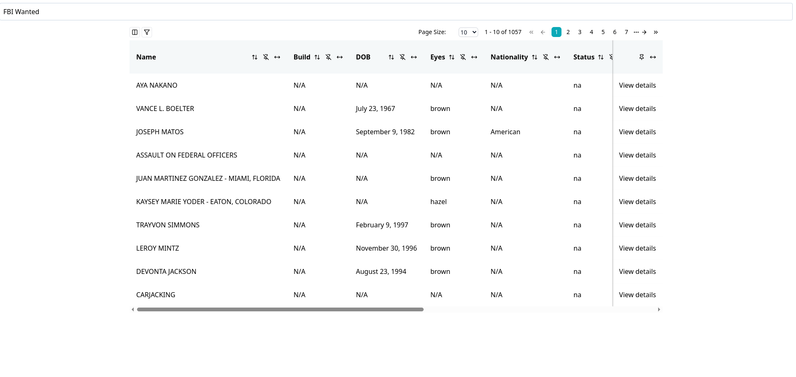
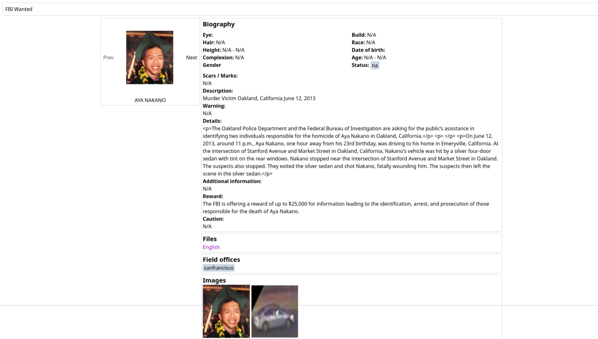

## Description

This is a simple project made with Tanstack start React framework. The API used is from FBI's missing persons API. API tooling for querying is Typescript OpenAPI to provide type-safety. No backend is involved in this project.

## References

1. https://api.fbi.gov/docs
2. https://openapi-ts.dev/introduction

## Screenshots

